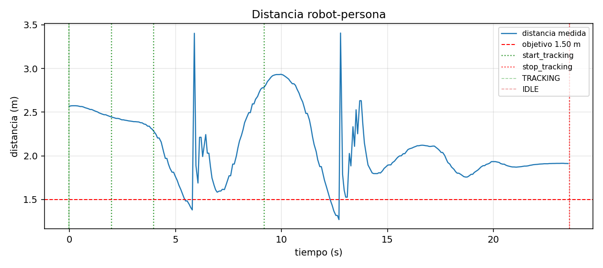
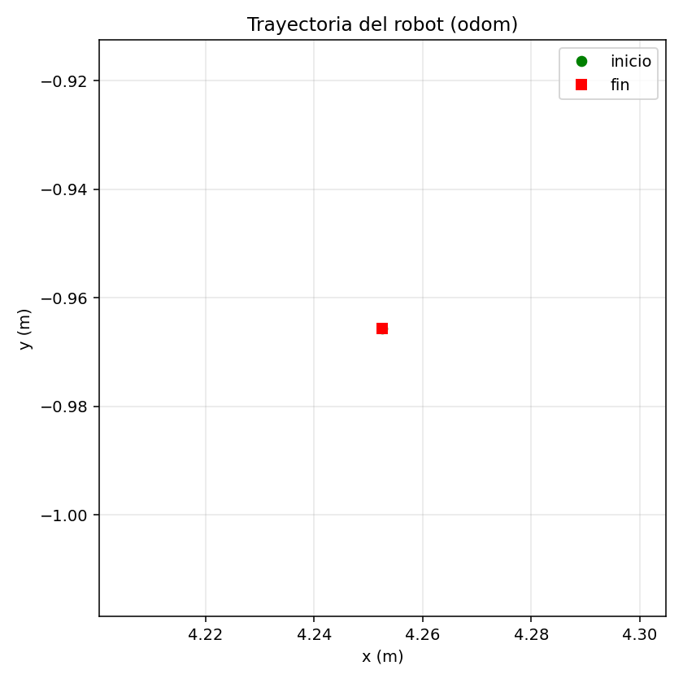
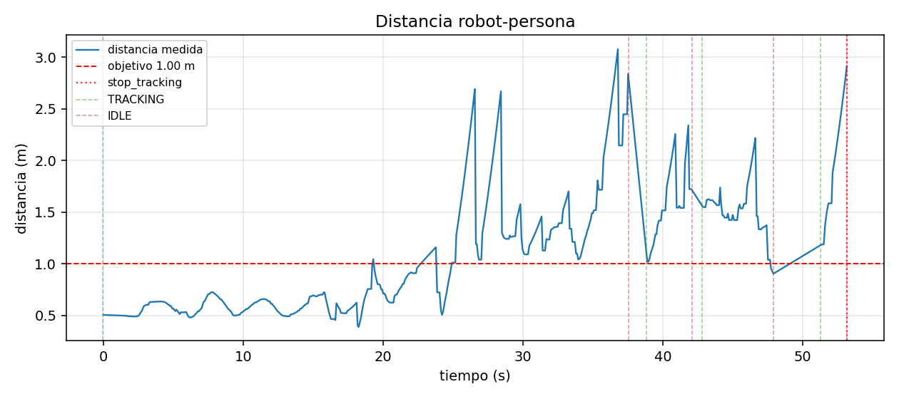
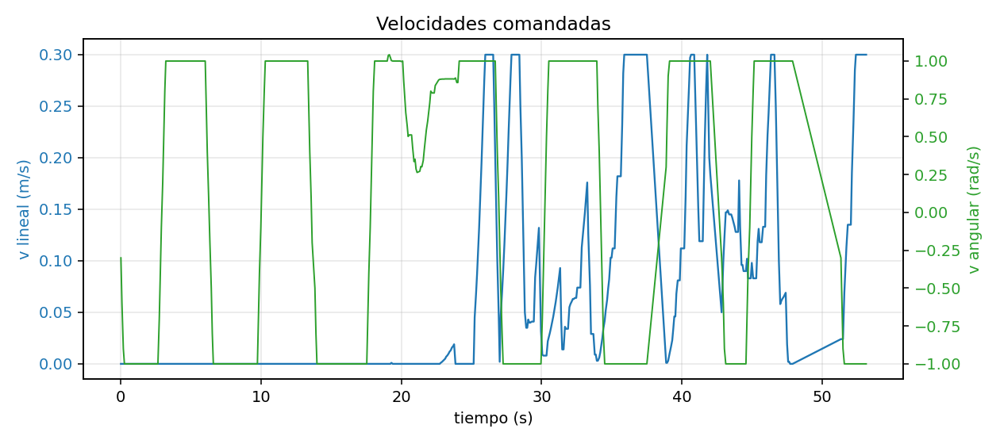
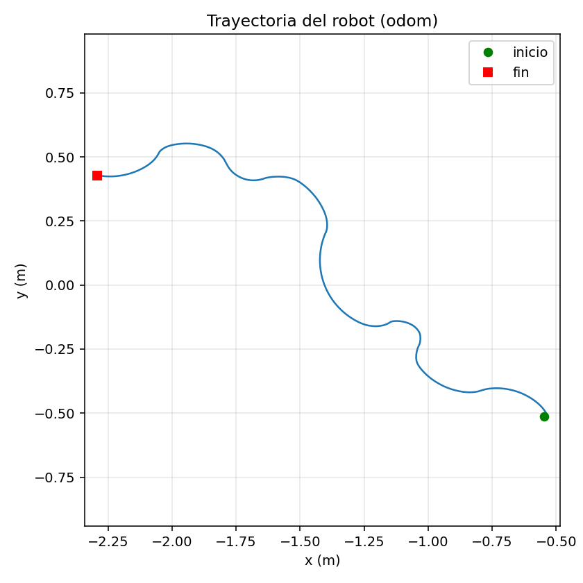

# Capítulo 7 — Resultados y evaluación (borrador)

> **Estado: borrador en progreso**, generado el 2026-07-09 a partir de las
> tomas ya recogidas en `validation/runs/`. Preparado sin acceso al robot —
> pendiente de completar con las tomas que faltan (ver 7.6) antes de darlo
> por cerrado. La metodología completa de captura/análisis está en
> [`validation/README.md`](../validation/README.md).

## 7.1 Metodología de validación

Cada toma se graba en el NUC como rosbag2 (`validation/record_run.sh`), se
convierte a CSV/TUM (`validation/bag_to_csv.py`) y se analiza en el portátil
(`validation/plot_run.py`), que genera `metrics.txt` y cuatro figuras:
`dist_vs_t.png`, `angle_vs_t.png`, `vel_vs_t.png`, `trayectoria.png`. Las
métricas estándar por toma son: error de distancia al objetivo (MAE y RMS),
error angular medio, velocidades máximas, % de tiempo con persona detectada
y número de pérdidas de detección.

Como se explica en 7.5, algunas cifras citadas en `PROGRESO.md` (% de saltos
de posición, % de saturación angular) se calcularon con un script *ad-hoc*
de la sesión 2026-07-08 que no forma parte de este pipeline — se citan aquí
con esa salvedad.

## 7.2 Configuración experimental

- **Robot:** TurtleBot 2 / base Kobuki, NUC `nuc-224`, ROS 2 Jazzy.
- **Sensores:** RPLIDAR A2M8 + cámara Logitech C270.
- **Entorno:** laboratorio de robótica UJI (interior, suelo de baldosas).
- **Distancia objetivo (`target_distance`):** 1.50 m en la toma del 25/06;
  1.00 m en las tomas del 08/07 (parámetro ajustado entre sesiones).
- **Activación del seguimiento:** gesto por cámara en condiciones normales;
  en las tomas del 08/07 se usó un workaround manual por SSH porque el
  gesto no era fiable con el encuadre de cámara de ese día (ver
  `docs/sesion_siguiente.md`, objetivo 1).

## 7.3 Resultado 1 — Fusión sensorial sin movimiento (2026-06-25)

Primera validación del fallback de fusión LiDAR-cámara (`docs/decisiones.md`,
entrada 2026-06-25), con la base inhibida (`/cmd_vel` redirigido, el robot no
se mueve) para poder probar el mecanismo de detección con seguridad antes de
validarlo en movimiento.

| Métrica | Valor |
|---|---|
| Duración | 23.5 s (285 muestras) |
| Distancia objetivo | 1.50 m |
| Error distancia MAE / RMS | 0.627 m / 0.733 m |
| Distancia mín. / máx. | 1.27 m / 3.41 m |
| % tiempo persona detectada | **100.0 %** |
| Nº pérdidas de detección | **0** |
| Desviación rumbo cámara vs. clúster elegido | ~6° (`bearing_sign=-1.0` confirmado) |

**Lectura:** con el fallback de fusión activo, la detección fue continua
durante toda la toma pese a que el LiDAR por sí solo no distinguía piernas
de forma fiable (motivación original del fallback, ver `docs/02_arquitectura.md`
§2.3.1). El error angular medio (172.3°, no tabulado arriba) no es
representativo del rumbo real: al estar la base inhibida, `wz` nunca corrige
la orientación hacia la persona, así que esa cifra mide la falta de
movimiento, no un fallo de detección — se excluye de la lectura de esta
toma por ese motivo.

## 7.4 Resultado 2 — Progresión de fixes de continuidad en movimiento (2026-07-08)

Primera prueba de seguimiento con el robot moviéndose de verdad. La toma
inicial reveló saltos de detección y saturación angular casi permanente
(motivación de los tres fixes de `docs/decisiones.md`, entrada
2026-07-08); las dos tomas siguientes verifican cada fix por separado.

| Toma | Duración | % detección | Pérdidas detec. | MAE dist. | RMS dist. | Saltos >0.8m* | Saturación `wz`* |
|---|---|---|---|---|---|---|---|
| Original (sin fix) | 759.8 s | 32.3 %†  | 79 | 0.519 m | 0.935 m | 3.5 % | 95.7 % |
| + fix 1 (gate continuidad) | 249.0 s | 71.7 % | 43 | 0.534 m | 0.725 m | 2.2 % | 99.3 % |
| + fix 2 y 3 (Mahalanobis + rate-limit `wz`) | 53.1 s | **82.6 %** | **13** | 0.491 m | **0.609 m** | **0.7 %** | 86.9 % |

\* Saltos de posición >0.8m y % de saturación angular con posición
localmente estable (ventana 1.0s, radio 0.15m — ver `validation/plot_run.py`).
**Reproducido 2026-07-21 (Sesión 4 de lab)** con el pipeline committeado
(`bag_to_csv.py` ejecutado en el NUC + `plot_run.py` en el portátil) sobre
los tres bags originales — ver `docs/decisiones.md` (2026-07-21) para el
detalle completo, incluida la comparación con las cifras *ad-hoc* de
`PROGRESO.md` (2026-07-08) que se citaban aquí hasta hoy: el % de saltos
reprodujo con exactitud en las tomas fix1/fix2 (2.2% y 0.7%) pero salió
bastante más bajo en la toma original (3.5% frente al 12.1% ad-hoc);
la saturación **no** reprodujo la tendencia decreciente del cálculo
ad-hoc — se mantiene alta en las tres tomas, ver lectura revisada abajo.

† El 32.3% corresponde al bag completo (759.8s, incluye el tiempo de
depuración del gesto antes de que empezara el seguimiento real).
`PROGRESO.md` reporta 56.9% para la ventana de ~130s de seguimiento real
tras filtrar ese tramo inicial — **cifra más representativa del
comportamiento en TRACKING**, pero no recalculada aquí porque el filtrado se
hizo a mano, no con un script committeado.

**Lectura (revisada 2026-07-21):** los tres fixes encadenados sí redujeron
de forma clara los saltos de posición implausibles (3.5%→2.2%→0.7%) y, como
efecto colateral, subieron la detección (71.7%→82.6%): menos saltos → Kalman
más estable → la FSM pierde menos el track. **La saturación de velocidad
angular, en cambio, no mejora de forma sostenida con estos tres fixes** —
se mantiene muy alta en las tres tomas (95.7%, 99.3%, 86.9% con posición
estable; 96.9%, 99.4%, 80.6% en global), sin la tendencia decreciente que
sugerían las cifras *ad-hoc* del 08/07. Los tres fixes de esta tabla atacan
la *continuidad de la detección* (gate de continuidad, Mahalanobis,
rate-limit de `wz`), no la *ganancia* del controlador angular — el ajuste
que sí reduce la saturación a corta distancia (`near_gain`, zona muerta
angular) se añadió después, el 2026-07-15 (ver `docs/decisiones.md`), y no
está reflejado en estos tres bags del 08/07. Queda como limitación abierta,
no como logro de esta serie de fixes — ver 7.5. Los tres bags decrecen en
duración porque las pruebas se fueron acotando a medida que el
comportamiento se estabilizaba, no por una razón experimental — ver 7.5.

*(Figuras equivalentes de las tomas "original" y "fix 1" disponibles en
`validation/runs/20260708_movimiento_original/analysis/figs/` y
`validation/runs/20260708_movimiento_fix1_gating/analysis/figs/` para la
comparación visual completa cuando se redacte la versión final.)*

## 7.4bis Resultado 3 — Repeticiones por escenario, sistema ya estabilizado (2026-07-22, Sesión 5)

Con los fixes de la Sesión 4 (2026-07-21) ya en producción (sector de
obstáculos corregido, fallback de pierna única, `continuity_confirm_frames=3`)
y `obstacle_threshold` recién subido de 0.35m a 0.40m (ver `docs/decisiones.md`,
2026-07-22), se repitieron 2-3 tomas de los cinco escenarios sin riesgo de
`validation/README.md` (se excluye `obstaculo`, pendiente de reintentar tras
el hallazgo de seguridad del 2026-07-21). Bags en
`validation/runs/20260722_*`.

| Escenario | Duración | MAE dist. | \|ang\| medio | % detect. | Pérdidas | % saltos >0.8m | Sat. \|vang\|≥0.95 (global / estable*) |
|---|---|---|---|---|---|---|---|
| `recta` (contaminada) | 41.4s | 0.626m | 62.0° | 76.2% | 7 | 6.8% | 39.7% / 13.8% |
| `recta` (limpia) | 25.9s | 0.420m | 26.5° | 100% | 0 | 2.3% | 21.1% / 1.8% |
| `curva` #1 | 33.5s | 0.794m | 14.5° | 100% | 0 | 2.8% | 9.4% / 6.8% |
| `curva` #2 (corta) | 12.2s | 0.759m | 23.7° | 97.1% | 1 | 2.0% | 24.5% / 20.8% |
| `curva` #3 | 14.3s | 0.976m | 6.2° | 100% | 0 | 0.9% | 0.0% / 0.0% |
| `parada` | 36.5s | 0.326m | 5.9° | 100% | 0 | 0.0% | 0.0% / 0.0% |
| `corto` #1 (dist. min 0.15m) | 32.5s | 0.443m | 32.8° | 100% | 0 | 2.0% | 17.4% / 25.1% |
| `corto` #2 (corta, dist. min 0.42m) | 8.4s | 0.628m | 4.9° | 98.8% | 1 | 0.9% | 0.0% / 0.0% |
| `corto` #3 (dist. min 0.02m) | 18.7s | 0.508m | 46.8° | 100% | 0 | 1.2% | 27.4% / 28.6% |
| `oclusion` | 30.6s | 0.678m | 16.2° | 100% | 0 | 2.5% | 11.5% / 1.5% |

\* "estable" = posición cruda con desviación ≤0.15m dentro del último 1.0s
(metodología propia, ver `docs/decisiones.md` 2026-07-09).

**Notas de interpretación:**

- **La primera toma `recta` quedó contaminada** por un estado de TRACKING
  residual de sesiones anteriores que no se había desautorizado con
  `stop_tracking` — reprodujo el mismo síntoma de oscilación FSM documentado
  desde el 17/06 (error angular 62°, saturación 39.7%). Tras enviar
  `stop_tracking` explícito antes de cada toma siguiente, no volvió a
  repetirse en las 9 tomas restantes de esta sesión. Se mantiene como fila
  documentada (limitación/comportamiento conocido), no se descarta.
- **Duraciones cortas en `curva` #2 y `corto` #2:** el gesto de activación
  tardó ~30-36s en llegar dentro de una ventana de grabación de 40-45s,
  dejando poco margen de movimiento real antes de que la grabación
  terminase por temporizador. No es un bug — las repeticiones #3 de ambos
  escenarios, con el gesto inmediato, capturaron 14-19s de seguimiento
  completo.
- **`corto` #3 alcanzó 0.02m de distancia mínima** (contacto casi literal
  con el robot) — saturación angular alta (27.4-28.6%) esperable a esa
  distancia, coherente con el análisis de `near_gain` del 2026-07-15 (no es
  un bug, es la dificultad física real de seguir a alguien muy cerca).
- **`oclusion` con 100% de detección:** el hueco de ocultación no llegó a
  producir una pérdida real (recuperación vía Kalman/fallback de pierna
  única), igual que `oclusion_v2_breve` del 15/07.
- Con estas 10 tomas, `recta`/`curva`/`corto` ya tienen 2-3 repeticiones (el
  objetivo de esta sesión); `parada` y `oclusion` se quedan en N=1 —
  repetirlas en una sesión futura si hay tiempo (no bloquea el Capítulo 7).

## 7.5 Limitaciones de los resultados actuales

- **Reproducibilidad de "saltos"/"saturación" — resuelta 2026-07-21, con
  matices:** las cifras originales de la tabla 7.4 se habían calculado con
  un script que no estaba en el repo (`bag_to_csv_direct.py`, sesión
  2026-07-08). Desde el 2026-07-09 ese cálculo forma parte del pipeline
  estándar (`bag_to_csv.py`/`plot_run.py`), y el 2026-07-21 (Sesión 4 de
  lab) se re-ejecutó sobre los tres bags originales del 08/07 en el NUC
  (que sí tiene ROS 2). El % de saltos de posición reprodujo con
  exactitud en dos de las tres tomas y quedó más bajo en la tercera — se
  considera una limitación menor, esperable de una metodología
  reconstruida y no una recuperación literal del script perdido. **La
  saturación angular, en cambio, no reprodujo la tendencia decreciente
  original en absoluto** — con el pipeline reproducible se mantiene alta
  (86-99%) en las tres tomas, sin la mejora de 94.5%→12.4% que sugerían
  las cifras ad-hoc. Tabla y lectura de 7.4 ya actualizadas con las cifras
  reproducibles. Ver `docs/decisiones.md` (2026-07-21) para el detalle
  completo de la comparación y la hipótesis de por qué diverge (denominador
  pequeño de muestras "estables" en las tomas cortas de fix1/fix2, y
  posible efecto de acercamiento a corta distancia sin `near_gain`, que no
  existía todavía el 08/07) — hipótesis sin confirmar, no verificada hoy.
- **N=1 por condición:** cada fila de la tabla 7.4 es una única toma, no una
  media de repeticiones — no hay todavía medida de varianza entre pruebas
  equivalentes. `validation/README.md` recomienda 2-3 repeticiones por
  escenario para el capítulo final.
- **Duraciones no comparables directamente:** las tres tomas de la tabla
  7.4 tienen duraciones muy distintas (759.8s / 249.0s / 53.1s), así que las
  cifras son proporciones dentro de cada toma, no valores normalizados a un
  mismo tiempo o misma distancia recorrida.
- **`near_gain` sin aislar:** ninguna toma actual aísla específicamente el
  caso que motivó ese parámetro (giro a corta distancia, 0.5-0.7m) — las
  tomas de movimiento mezclan alejarse/acercarse/lateral/giro.
- **Gate de continuidad reforzado (2026-07-09) sin validar:** el cambio de
  `docs/decisiones.md` (confirmación por consistencia,
  `continuity_confirm_frames`) se preparó sin robot y solo se verificó con
  pruebas de lógica aisladas — la tabla 7.4 es anterior a ese cambio y no lo
  refleja.
- **Gesto de activación no utilizado:** las tomas de movimiento se activaron
  con un workaround manual por SSH, no con el gesto real (encuadre de
  cámara pendiente de corregir) — el objetivo específico 1 del TFM no está
  representado en estos resultados todavía.

## 7.6 Pendiente para completar este capítulo

- [x] ~~Validar `near_gain` de forma aislada~~ — hecho 2026-07-15, ver
  `PROGRESO.md`. Reforzado con casos límite el 2026-07-22 (`corto` #3, 0.02m).
- [x] ~~Repetir tomas con `continuity_confirm_frames` ajustado~~ — hecho
  2026-07-21 (Sesión 4), ver 7.4bis y `docs/decisiones.md`.
- [x] ~~Re-ejecutar `bag_to_csv.py`/`plot_run.py` sobre los tres bags de la
  tabla 7.4~~ — hecho 2026-07-21, tabla 7.4 ya actualizada.
- [x] ~~Repeticiones (2-3 tomas por escenario)~~ — hecho 2026-07-22 para
  `recta`/`curva`/`corto` (ver 7.4bis). `parada`/`oclusion` siguen en N=1.
- [x] ~~Grabar al menos una toma con el gesto real funcionando~~ — hecho
  desde 2026-07-09, todas las tomas de 7.4bis usan el gesto real.
- [ ] Repetir `parada` y `oclusion` una vez más cada una (N=1 todavía) si
  sobra tiempo en una sesión futura — no bloquea el capítulo.
- [ ] **Repetir `obstaculo` con `obstacle_threshold=0.40m`** (subido
  2026-07-22) para confirmar que evita el 2º tipo de contacto del
  2026-07-21 — pendiente de decidir con el autor cuándo, ver aviso de
  seguridad en `docs/sesion_siguiente.md`. El 1er tipo de contacto (límite
  de altura del LIDAR 2D) sigue sin mitigar y probablemente quede como
  limitación documentada (ver 7.5 y mitigaciones en `docs/decisiones.md`
  2026-07-21).
- [ ] Actualizar §7.5 (limitaciones) — varias de las entradas actuales están
  desactualizadas por los fixes de las Sesiones 4-5 (gate de continuidad,
  `near_gain`, gesto real) y necesitan una revisión completa antes de
  cerrar el capítulo, no solo añadir 7.4bis.
- [ ] Incorporar resultados de Nav2 si se decide abordarlo (objetivo 3,
  sigue pendiente de decidir alcance).
- [ ] Sustituir este borrador por prosa de memoria una vez el conjunto de
  datos esté completo — este archivo está pensado como andamiaje de
  trabajo, no como texto final de la memoria.
