# Capítulo 7 — Resultados y evaluación (borrador)

> **Estado: borrador en progreso**, generado el 2026-07-09 a partir de las
> tomas ya recogidas en `validation/runs/`. Preparado sin acceso al robot —
> pendiente de completar con las tomas que faltan (ver 7.6) antes de darlo
> por cerrado. La metodología completa de captura/análisis está en
> [`validation/README.md`](../validation/README.md).

## 7.1 Metodología de validación

Cada toma se graba en el NUC como rosbag2 (`validation/record_run.sh`), se
convierte a CSV/TUM (`validation/bag_to_csv.py`) y se analiza en el portátil
(`validation/plot_run.py`), que genera `metrics.txt` y cuatro figuras:
`dist_vs_t.png`, `angle_vs_t.png`, `vel_vs_t.png`, `trayectoria.png`. Las
métricas estándar por toma son: error de distancia al objetivo (MAE y RMS),
error angular medio, velocidades máximas, % de tiempo con persona detectada
y número de pérdidas de detección.

Como se explica en 7.5, algunas cifras citadas en `PROGRESO.md` (% de saltos
de posición, % de saturación angular) se calcularon con un script *ad-hoc*
de la sesión 2026-07-08 que no forma parte de este pipeline — se citan aquí
con esa salvedad.

## 7.2 Configuración experimental

- **Robot:** TurtleBot 2 / base Kobuki, NUC `nuc-224`, ROS 2 Jazzy.
- **Sensores:** RPLIDAR A2M8 + cámara Logitech C270.
- **Entorno:** laboratorio de robótica UJI (interior, suelo de baldosas).
- **Distancia objetivo (`target_distance`):** 1.50 m en la toma del 25/06;
  1.00 m en las tomas del 08/07 (parámetro ajustado entre sesiones).
- **Activación del seguimiento:** gesto por cámara en condiciones normales;
  en las tomas del 08/07 se usó un workaround manual por SSH porque el
  gesto no era fiable con el encuadre de cámara de ese día (ver
  `docs/sesion_siguiente.md`, objetivo 1).

## 7.3 Resultado 1 — Fusión sensorial sin movimiento (2026-06-25)

Primera validación del fallback de fusión LiDAR-cámara (`docs/decisiones.md`,
entrada 2026-06-25), con la base inhibida (`/cmd_vel` redirigido, el robot no
se mueve) para poder probar el mecanismo de detección con seguridad antes de
validarlo en movimiento.

| Métrica | Valor |
|---|---|
| Duración | 23.5 s (285 muestras) |
| Distancia objetivo | 1.50 m |
| Error distancia MAE / RMS | 0.627 m / 0.733 m |
| Distancia mín. / máx. | 1.27 m / 3.41 m |
| % tiempo persona detectada | **100.0 %** |
| Nº pérdidas de detección | **0** |
| Desviación rumbo cámara vs. clúster elegido | ~6° (`bearing_sign=-1.0` confirmado) |

**Lectura:** con el fallback de fusión activo, la detección fue continua
durante toda la toma pese a que el LiDAR por sí solo no distinguía piernas
de forma fiable (motivación original del fallback, ver `docs/02_arquitectura.md`
§2.3.1). El error angular medio (172.3°, no tabulado arriba) no es
representativo del rumbo real: al estar la base inhibida, `wz` nunca corrige
la orientación hacia la persona, así que esa cifra mide la falta de
movimiento, no un fallo de detección — se excluye de la lectura de esta
toma por ese motivo.

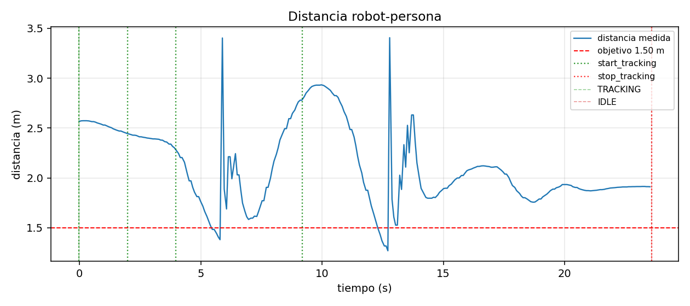
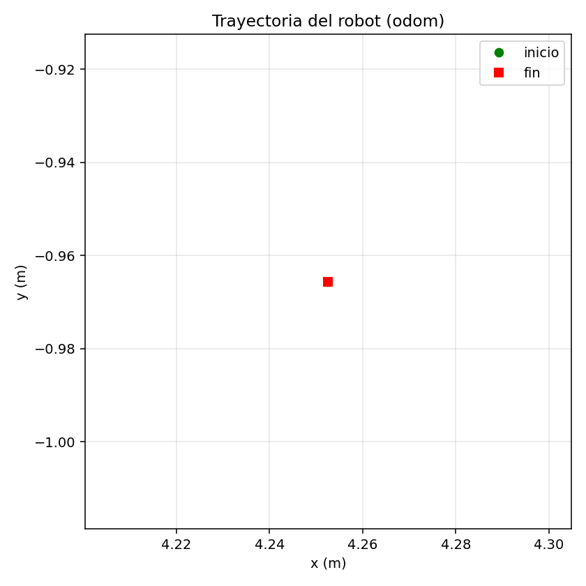

## 7.4 Resultado 2 — Progresión de fixes de continuidad en movimiento (2026-07-08)

Primera prueba de seguimiento con el robot moviéndose de verdad. La toma
inicial reveló saltos de detección y saturación angular casi permanente
(motivación de los tres fixes de `docs/decisiones.md`, entrada
2026-07-08); las dos tomas siguientes verifican cada fix por separado.

| Toma | Duración | % detección | Pérdidas detec. | MAE dist. | RMS dist. | Saltos >0.8m* | Saturación `wz`* |
|---|---|---|---|---|---|---|---|
| Original (sin fix) | 759.8 s | 32.3 %†  | 79 | 0.519 m | 0.935 m | 3.5 % | 95.7 % |
| + fix 1 (gate continuidad) | 249.0 s | 71.7 % | 43 | 0.534 m | 0.725 m | 2.2 % | 99.3 % |
| + fix 2 y 3 (Mahalanobis + rate-limit `wz`) | 53.1 s | **82.6 %** | **13** | 0.491 m | **0.609 m** | **0.7 %** | 86.9 % |

\* Saltos de posición >0.8m y % de saturación angular con posición
localmente estable (ventana 1.0s, radio 0.15m — ver `validation/plot_run.py`).
**Reproducido 2026-07-21 (Sesión 4 de lab)** con el pipeline committeado
(`bag_to_csv.py` ejecutado en el NUC + `plot_run.py` en el portátil) sobre
los tres bags originales — ver `docs/decisiones.md` (2026-07-21) para el
detalle completo, incluida la comparación con las cifras *ad-hoc* de
`PROGRESO.md` (2026-07-08) que se citaban aquí hasta hoy: el % de saltos
reprodujo con exactitud en las tomas fix1/fix2 (2.2% y 0.7%) pero salió
bastante más bajo en la toma original (3.5% frente al 12.1% ad-hoc);
la saturación **no** reprodujo la tendencia decreciente del cálculo
ad-hoc — se mantiene alta en las tres tomas, ver lectura revisada abajo.

† El 32.3% corresponde al bag completo (759.8s, incluye el tiempo de
depuración del gesto antes de que empezara el seguimiento real).
`PROGRESO.md` reporta 56.9% para la ventana de ~130s de seguimiento real
tras filtrar ese tramo inicial — **cifra más representativa del
comportamiento en TRACKING**, pero no recalculada aquí porque el filtrado se
hizo a mano, no con un script committeado.

**Lectura (revisada 2026-07-21):** los tres fixes encadenados sí redujeron
de forma clara los saltos de posición implausibles (3.5%→2.2%→0.7%) y, como
efecto colateral, subieron la detección (71.7%→82.6%): menos saltos → Kalman
más estable → la FSM pierde menos el track. **La saturación de velocidad
angular, en cambio, no mejora de forma sostenida con estos tres fixes** —
se mantiene muy alta en las tres tomas (95.7%, 99.3%, 86.9% con posición
estable; 96.9%, 99.4%, 80.6% en global), sin la tendencia decreciente que
sugerían las cifras *ad-hoc* del 08/07. Los tres fixes de esta tabla atacan
la *continuidad de la detección* (gate de continuidad, Mahalanobis,
rate-limit de `wz`), no la *ganancia* del controlador angular — el ajuste
que sí reduce la saturación a corta distancia (`near_gain`, zona muerta
angular) se añadió después, el 2026-07-15 (ver `docs/decisiones.md`), y no
está reflejado en estos tres bags del 08/07. Queda como limitación abierta,
no como logro de esta serie de fixes — ver 7.5. Los tres bags decrecen en
duración porque las pruebas se fueron acotando a medida que el
comportamiento se estabilizaba, no por una razón experimental — ver 7.5.

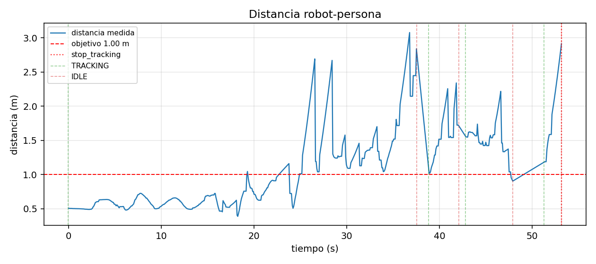
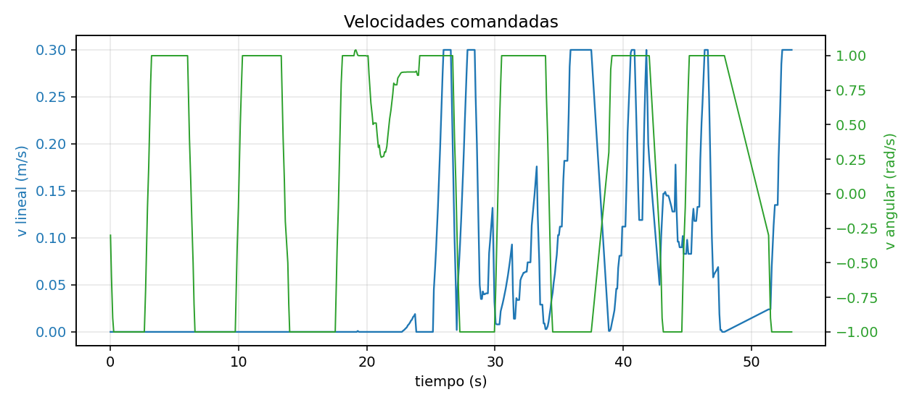
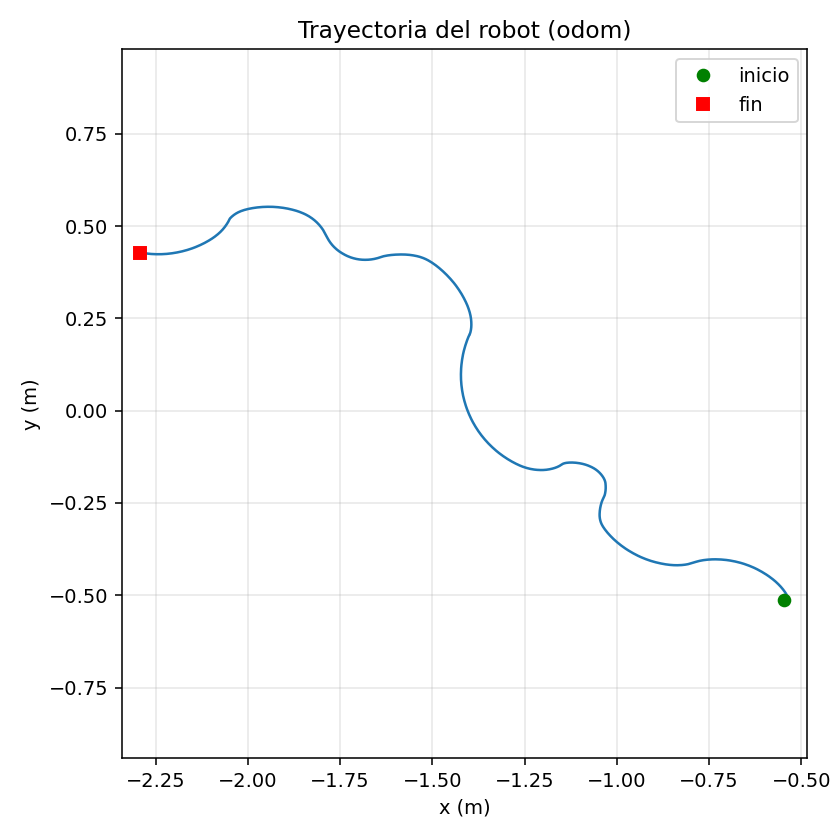

*(Figuras equivalentes de las tomas "original" y "fix 1" disponibles en
`validation/runs/20260708_movimiento_original/analysis/figs/` y
`validation/runs/20260708_movimiento_fix1_gating/analysis/figs/` para la
comparación visual completa cuando se redacte la versión final.)*

## 7.4bis Resultado 3 — Repeticiones por escenario, sistema ya estabilizado (2026-07-22, Sesión 5)

Con los fixes de la Sesión 4 (2026-07-21) ya en producción (sector de
obstáculos corregido, fallback de pierna única, `continuity_confirm_frames=3`)
y `obstacle_threshold` recién subido de 0.35m a 0.40m (ver `docs/decisiones.md`,
2026-07-22), se repitieron 2-3 tomas de los cinco escenarios sin riesgo de
`validation/README.md` (se excluye `obstaculo`, pendiente de reintentar tras
el hallazgo de seguridad del 2026-07-21). Bags en
`validation/runs/20260722_*`.

| Escenario | Duración | MAE dist. | \|ang\| medio | % detect. | Pérdidas | % saltos >0.8m | Sat. \|vang\|≥0.95 (global / estable*) |
|---|---|---|---|---|---|---|---|
| `recta` (contaminada) | 41.4s | 0.626m | 62.0° | 76.2% | 7 | 6.8% | 39.7% / 13.8% |
| `recta` (limpia) | 25.9s | 0.420m | 26.5° | 100% | 0 | 2.3% | 21.1% / 1.8% |
| `curva` #1 | 33.5s | 0.794m | 14.5° | 100% | 0 | 2.8% | 9.4% / 6.8% |
| `curva` #2 (corta) | 12.2s | 0.759m | 23.7° | 97.1% | 1 | 2.0% | 24.5% / 20.8% |
| `curva` #3 | 14.3s | 0.976m | 6.2° | 100% | 0 | 0.9% | 0.0% / 0.0% |
| `parada` | 36.5s | 0.326m | 5.9° | 100% | 0 | 0.0% | 0.0% / 0.0% |
| `corto` #1 (dist. min 0.15m) | 32.5s | 0.443m | 32.8° | 100% | 0 | 2.0% | 17.4% / 25.1% |
| `corto` #2 (corta, dist. min 0.42m) | 8.4s | 0.628m | 4.9° | 98.8% | 1 | 0.9% | 0.0% / 0.0% |
| `corto` #3 (dist. min 0.02m) | 18.7s | 0.508m | 46.8° | 100% | 0 | 1.2% | 27.4% / 28.6% |
| `oclusion` | 30.6s | 0.678m | 16.2° | 100% | 0 | 2.5% | 11.5% / 1.5% |

\* "estable" = posición cruda con desviación ≤0.15m dentro del último 1.0s
(metodología propia, ver `docs/decisiones.md` 2026-07-09).

**Notas de interpretación:**

- **La primera toma `recta` quedó contaminada** por un estado de TRACKING
  residual de sesiones anteriores que no se había desautorizado con
  `stop_tracking` — reprodujo el mismo síntoma de oscilación FSM documentado
  desde el 17/06 (error angular 62°, saturación 39.7%). Tras enviar
  `stop_tracking` explícito antes de cada toma siguiente, no volvió a
  repetirse en las 9 tomas restantes de esta sesión. Se mantiene como fila
  documentada (limitación/comportamiento conocido), no se descarta.
- **Duraciones cortas en `curva` #2 y `corto` #2:** el gesto de activación
  tardó ~30-36s en llegar dentro de una ventana de grabación de 40-45s,
  dejando poco margen de movimiento real antes de que la grabación
  terminase por temporizador. No es un bug — las repeticiones #3 de ambos
  escenarios, con el gesto inmediato, capturaron 14-19s de seguimiento
  completo.
- **`corto` #3 alcanzó 0.02m de distancia mínima** (contacto casi literal
  con el robot) — saturación angular alta (27.4-28.6%) esperable a esa
  distancia, coherente con el análisis de `near_gain` del 2026-07-15 (no es
  un bug, es la dificultad física real de seguir a alguien muy cerca).
- **`oclusion` con 100% de detección:** el hueco de ocultación no llegó a
  producir una pérdida real (recuperación vía Kalman/fallback de pierna
  única), igual que `oclusion_v2_breve` del 15/07.
- Con estas 10 tomas, `recta`/`curva`/`corto` ya tienen 2-3 repeticiones (el
  objetivo de esta sesión); `parada` y `oclusion` se quedan en N=1 —
  repetirlas en una sesión futura si hay tiempo (no bloquea el Capítulo 7).
- **Intento de repetición el 2026-07-29 (Sesión 8), no válido como N=2:** al
  repetir `parada` acercándose demasiado al robot, `_obstacle_avoidance`
  trató a la propia persona seguida como un obstáculo sólido y disparó la
  maniobra de rodeo contra ella (error angular medio 41.7°, saturación
  32.3% — muy por encima del 5.9°/0.0% de la fila de arriba). No se añade
  como fila nueva porque el protocolo de la prueba, no el sistema, fue la
  causa. El intento de `oclusion` no generó datos de bag utilizables, pero
  sí reveló un salto de posición espurio (~2.3m en 1.15s) justo al
  recuperar la detección tras el hueco de oclusión, coincidente con un giro
  brusco hacia una pared observado en vivo. Ver `docs/decisiones.md`
  (2026-07-29) para el detalle completo de ambos hallazgos, pendientes de
  arreglo y repetición limpia en la Sesión 9.

## 7.4ter Resultado 4 — Escenario `obstaculo`: de 4 contactos reales a evasión + rodeo sin contacto (2026-07-22)

Con `obstacle_threshold` ya subido a 0.40m (§7.4bis), se reintentó en vivo
el escenario `obstaculo` (aviso de seguridad del 21/07 — 2 choques
previos). Cinco tomas en la misma sesión, con dos cambios de código en
medio. Bags en `validation/runs/20260722_obstaculo_v[3-7]*`.

| Toma | Código en ese momento | Resultado |
|---|---|---|
| `obstaculo_v3` (mueble, persona rodeándolo del todo) | umbral 0.40m, `lin_factor` viejo | **Contacto leve.** `lin_factor` fijo en 0.4 durante ~12s, robot "arrastrando" sin parar |
| `obstaculo_v4` (mueble, pasando cerca sin ocultarse) | igual | **Contacto leve otra vez.** Seguimiento a persona limpio (100% detect.), mismo patrón de arrastre (~10s) |
| `obstaculo_v5` (mismo mueble) | **`lin_factor` corregido** (rampa 1.0→0.0 entre 0.40m y 0.25m, basada en distancia mínima real) | **Sin contacto.** Encuentro con el obstáculo mucho más corto (~2.5s vs 10-12s) |
| `obstaculo_v6_dos` (mueble + silla, sin activar la maniobra) | igual | Sin contacto. Solo un episodio de evasión detectado (mueble); la silla no llegó a activar `lin_factor<1.0` en esta toma — sin dato sobre si la superó o simplemente no se acercó lo suficiente |
| `obstaculo_v7_rodeo` (mueble + silla, 60s) | **+ maniobra de rodeo nueva** (giro cerrado + avance corto si `lin_factor` bajo sostenido) | **Sin contacto.** Maniobra disparada 4 veces: 2 completadas limpio, 1 abortada correctamente por seguridad (nuevo obstáculo durante el avance), 1 en curso al terminar. 100% detección, 0 pérdidas, 0% saturación |
| `obstaculo_v8_mueble_silla` (mueble + silla otra vez) | igual | **Mueble: rodeo correcto** (giro+avance+retoma seguimiento). **Silla: CONTACTO DIRECTO** — confirmado por el autor que la silla "no se detectó en absoluto" (geometría demasiado fina). La maniobra se disparó pero no pudo evitar el choque de un obstáculo no detectado |
| `obstaculo_v9_mueble` (2026-07-23, mismo mueble sólido, persona rodeándolo) | igual (sin cambios de código desde el 22/07) | **Sin contacto.** Único encuentro en 43s de toma: parada dura completa (`lin_factor` 1.0→0.0 en ~1.5s), maniobra de rodeo completa (dos fases de giro a 0.5 rad/s ~1.5s cada una + avance a 0.12 m/s ~2s), pérdida y reenganche breve de la posición de la persona durante el giro (esperable, no es un fallo nuevo), vuelta limpia al seguimiento normal después. Confirmado sin contacto por el autor |

**Segunda repetición limpia (N=2) confirmada 2026-07-23** para el fix de
`lin_factor` + maniobra de rodeo con mobiliario sólido — ver
`validation/runs/20260723_obstaculo_v9_mueble/` y `docs/decisiones.md`
(2026-07-23).

**Hallazgo de código central:** la fórmula original de `lin_factor`
(`max(0.3, 1.0-0.6*min(1.0,threat/0.5))`) nunca bajaba de 0.4 en la
práctica — el suelo `max(0.3,...)` era código muerto, ya que
`threat/0.5` satura en 1.0 dando `1.0-0.6=0.4`. La evasión reactiva nunca
frenaba del todo, y con un encuentro sostenido (persona rodeando un
obstáculo cerca del robot) eso se traducía en un "arrastre" a velocidad
reducida pero no nula, terminando en contacto leve pese a detectar el
obstáculo correctamente. Corregido basando `lin_factor` en la distancia
mínima real del sector frontal, con una parada dura real a
`obstacle_stop_distance` (0.25m). Detalle completo, incluida la nueva
maniobra de rodeo (giro + avance, con aborto de seguridad), en
`docs/decisiones.md` (2026-07-22).

**Limitaciones de este resultado:**
- ~~N=1 por variante de código~~ — **N=2 confirmado 2026-07-23** (`v9`,
  ver fila de arriba): el resultado limpio con mobiliario sólido se
  sostiene en una segunda sesión distinta, no solo dentro de la sesión
  donde se implementó el fix.
- **CONFIRMADO (`v8`), no ya solo sospechado:** el punto ciego de altura
  del LIDAR 2D (~47cm) con obstáculos de geometría fina (la silla del
  21/07) provoca contacto directo porque el obstáculo **no se detecta en
  absoluto** — ni el nuevo `lin_factor` ni la maniobra de rodeo pueden
  actuar sobre algo que el sensor no ve. Van 5 contactos reales en total
  (2 el 21/07, 3 hoy) con este tipo de mobiliario. **Decisión tomada
  2026-07-22: no reintentar en vivo con este tipo de objeto sin antes
  mitigar por hardware/sensor** (Orbbec RGBD, segundo LIDAR a otra altura)
  — queda como limitación de arquitectura confirmada para el capítulo de
  conclusiones, no como pendiente de retest.
- La maniobra de rodeo usa un giro de duración fija (no verificado con
  odometría) — podría no bastar para obstáculos más anchos que los
  probados hoy. Sí funcionó de forma consistente con el mueble sólido
  (`v7`, `v8`).

## 7.4quater Resultado 5 — Nav2: localización y navegación autónoma (2026-07-27, Sesión 7)

Objetivo específico 3 del TFM. Primera prueba real de la pila completa de
Nav2 (fase A y fase B, ambas en la misma sesión) — hasta esta sesión el
andamiaje (`nav2_localization_demo.launch.py`, `nav2_params.yaml`,
`scripts/nav2_send_goal.py`) llevaba escrito desde el 2026-07-09 sin
ejecutarse nunca.

**Fase A — localización (AMCL):** la Sesión 6 (2026-07-23) había dejado
esta fase sin cerrar: el mapa cargaba y AMCL se activaba, pero
`/amcl_pose`/`map→odom` parecían quedarse congelados tras el primer ciclo,
sin RViz disponible esa sesión para diagnosticar más. Con RViz disponible
en la Sesión 7, se aisló la causa real: los comandos de movimiento de
prueba (procesos `ros2 topic pub` nuevos por SSH, de 1.5-2s) nunca
llegaban al robot por la latencia de descubrimiento DDS entre un proceso
recién lanzado y el nodo del robot ya en marcha — el robot nunca se movía
de verdad, así que AMCL no tenía ningún delta de movimiento que procesar.
No era un bug de AMCL ni de configuración. Con comandos de 6-8s de
duración, el robot se movió de verdad y AMCL actualizó su pose
correctamente en dos pruebas consecutivas. Detalle completo en
`docs/decisiones.md` (2026-07-27).

**Fase B — navegación (planner + controller + behaviors + BT):** probada
por primera vez, lanzando `controller_server`/`planner_server`/
`behavior_server`/`bt_navigator` + `lifecycle_manager_navigation` a mano
(sin reiniciar la localización ya convergida). Objetivos mandados con el
botón "Nav2 Goal" de RViz.

| Objetivo | Distancia aprox. | Resultado |
|---|---|---|
| 1 | ~3.7m | Éxito |
| 2 | ~5.9m | Éxito |
| 3 (obstáculo real no mapeado en el camino) | ~5.3m | Éxito — costmap local lo detectó vía `/scan` y lo esquivó |
| 4 | ~8.0m | Éxito |
| 5 | ~8.1m | Éxito |
| 6 | ~0.6m (preemption rápida a mitad del objetivo anterior) | **Fallo** (`Goal failed`) — recuperación automática de `lifecycle_manager_navigation` (reset+reconfigure+reactivate, ~2s) |
| 7 | ~3.6m (tras la recuperación) | Éxito |

**6 de 7 objetivos completados con éxito** (86%), incluyendo dos trayectos
largos (~8m) y uno con evasión de un obstáculo real, deliberadamente no
presente en el mapa estático, detectado y esquivado por el `local_costmap`
sin intervención. El único fallo fue autorrecuperado por el propio
`nav2_lifecycle_manager` sin intervención manual, y no volvió a repetirse
en preemptions posteriores.

**Regrabado del mapa:** de camino, se detectó que el mapa guardado
(`maps/mapa_laboratorio.yaml`/`.pgm`) no reflejaba bien el laboratorio real
y le faltaban zonas. Regrabado con `slam_toolbox` (348×358 celdas @ 0.05m,
antes 261×338) y validado localizando sobre él antes de sustituirlo como
mapa oficial. Todos los resultados de esta tabla usan ya el mapa nuevo.

**Limitaciones de este resultado:**
- N=1 por escenario de navegación — no hay repeticiones para separar la
  variabilidad real de la puntual (p.ej. si el fallo del objetivo 6 se
  repetiría con otra preemption similar).
- No investigada la causa exacta de por qué esa preemption concreta causó
  un fallo y no las demás — posible condición de carrera en el árbol de
  comportamiento al cancelar mientras replanifica. Ver `docs/decisiones.md`
  (2026-07-27).
- `/particle_cloud` no es visible en RViz con la configuración por defecto
  (incompatibilidad de QoS `BEST_EFFORT`/`RELIABLE`) — no afecta a la
  navegación, solo impide verificar visualmente la convergencia de
  partículas sin cambiar la config de RViz.
- ~~No se ha probado el objetivo 5 del TFM (seguir a la persona → navegar a
  un destino)~~ — primer paso integrado y validado el 2026-09-23 con el
  gesto "casa", ver §7.4quinquies.

## 7.4quinquies Resultado 6 — Gesto "casa": seguimiento + Nav2 integrados (2026-09-23, sesión final)

Primer paso del objetivo específico 5. Con un cuarto gesto ("tejado": las
dos muñecas juntas por encima de la cabeza), el usuario ordena al robot que
deje de seguirle y vuelva de forma autónoma, con Nav2, a una pose fija
"casa". Es la primera vez que el seguimiento y Nav2 corren a la vez, con
`control_node` decidiendo qué velocidad llega a la base (diseño en §2.9 y
`docs/decisiones.md`, 2026-09-23).

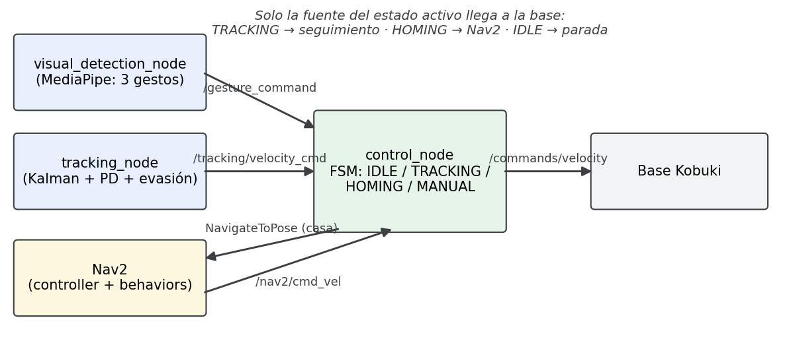
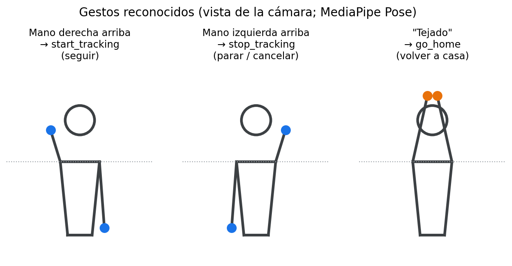

**Verificación previa, sin robot (reproducible):**

| Prueba | Qué comprueba | Resultado |
|---|---|---|
| `validation/verify_home_gesture.py` | Clasificación y exclusión mutua de los 3 gestos con landmarks sintéticos (de frente, de espaldas, subida asimétrica, "V", baja visibilidad) | 16/16 |
| `validation/verify_homing_fsm.py` (Docker, ROS 2 Jazzy) | `control_node` real contra un Nav2 simulado: éxito, cancelación, aborto, rechazo, sin servidor, solo velocidad de Nav2 en HOMING | 17/17 |
| `validation/verify_reacquire_sector.py` (Docker) | `detection_node` real con scans sintéticos: no reengancha a un mueble detrás, reengancha delante y a 70° de lado, sigue con ancla hasta 78° | 7/7 |
| `validation/verify_lost_search.py` (Docker) | `tracking_node` real: gira hacia el lado de la última observación, acotado a 0.5 rad/s, se para a los 2.6 s, no gira si la perdió de frente | 5/5 |

**En el robot real:** casa en (5.10, −7.76, −141°) del mapa del laboratorio.
Se usa la pose de AMCL al aparcar el robot, leída con
`scripts/print_home_pose.py`.

| Prueba | N | Resultado |
|---|---|---|
| C1 — tejado desde IDLE → casa | 6 | 5/6 ✅; 1 fallo por localización junto a la pared noreste |
| C2 — tejado en pleno seguimiento → casa (escena de demo) | 5 | 4/5 ✅; 1 fallo por localización junto a mobiliario (la 1ª toma de C4) |
| C3 — cancelar con la mano izquierda durante HOMING | 1 | ✅ Nav2 cancela en 20 ms, el robot se desplaza ~7 cm; otro tejado lo reanuda |
| C4 — tejado de espaldas a la cámara (dentro de C2) | 2 | 2/2 detectado. Vuelta completa 1/2: el fallo es el de C2 (localización), no del gesto |
| C5 — falsos positivos (~4 min de seguimiento gesticulando) | — | 0 `go_home` falsos |
| Total HOMING | 12 | **9 éxitos, 1 cancelación intencionada, 2 fallos** (9/11 = 82% de las vueltas pedidas) |

C4 está incluida en C2 (el tejado de espaldas se hizo en pleno seguimiento).
Total: 6 desde IDLE + 5 desde TRACKING + 1 cancelada = 12.

| Métrica (9 éxitos) | Valor |
|---|---|
| Tiempo gesto → IDLE en casa | 15.5 s de media (11.3-20.5 s) |
| Error de llegada (TF `map→base_footprint` tras llegar, 7 con bag) | 0.27 m de media (0.21-0.33 m) · 8.1° (3.9-14.6°) |
| Latencia gesto confirmado → HOMING | < 5 ms (confirmar el gesto exige ~1.2 s de pose mantenida) |
| Seguir sin gesto nuevo tras llegar a casa | 0 veces |

El error de llegada queda en torno a `xy_goal_tolerance` = 0.25 m y
`yaw_goal_tolerance` = 0.25 rad (14°). Nav2 da el objetivo por alcanzado con
su estimación del momento y AMCL la corrige ligeramente después. Parte del
error, por tanto, es de localización (σ≈0.5 m durante la sesión) y no de
control.

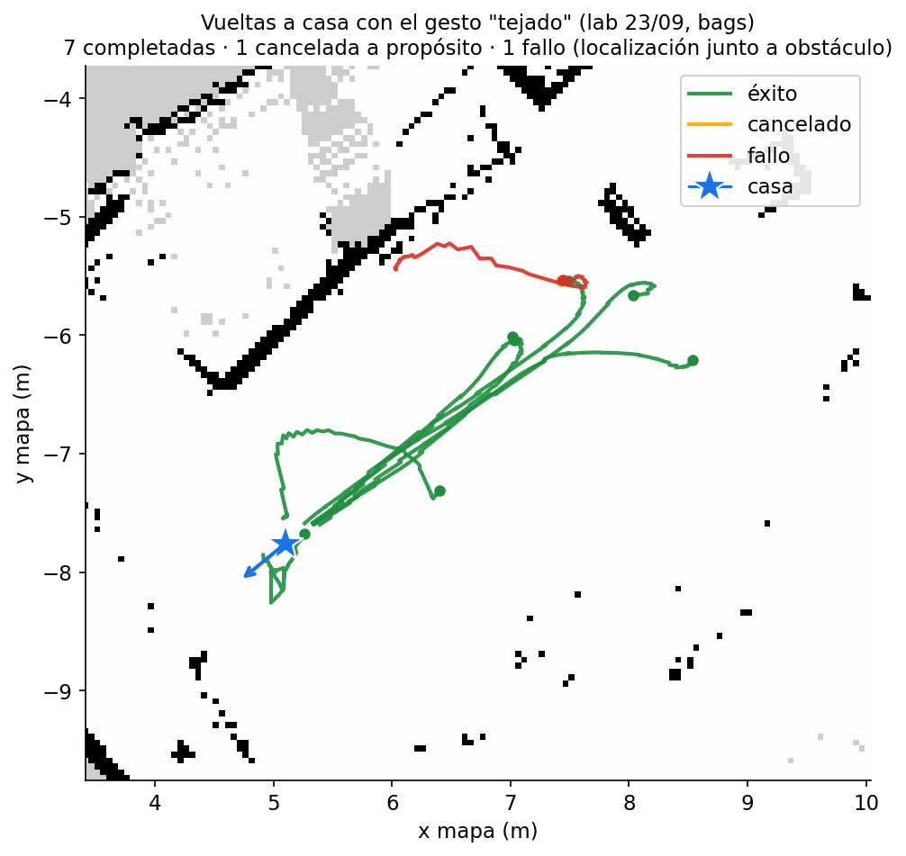
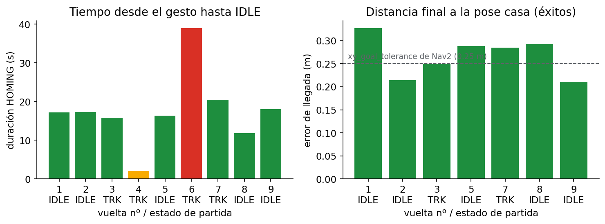

**Fallos (2/11):** en los dos, la pose estimada del robot al pedir casa
caía dentro de la zona letal inflada de un obstáculo del mapa (una línea de
mobiliario y la pared noreste). NavFn no planifica desde una celda letal:
tras 12 replanificaciones y las recuperaciones de Nav2, el objetivo aborta
y `control_node` vuelve a IDLE, como estaba diseñado. La causa combina la
incertidumbre de AMCL (en un caso la estimación saltó 0.4 m durante el giro
de recuperación) con que el seguimiento, que no usa el mapa, había llevado
al robot pegado al obstáculo.

**Fixes del seguimiento encontrados durante estas pruebas** (validados en
vivo; detalle en `docs/decisiones.md`, 2026-09-23 lab):

| Problema observado | Causa | Fix | Efecto medido |
|---|---|---|---|
| El seguimiento "se ralla" | Reenganche a retornos a 0.10-0.15 m (pegados al chasis) | `min_detection_distance` 0.10 → 0.30 m | Avisos de obstáculo frontal: 119 → 0; percibido "mucho más fluido" |
| El robot se engancha a mobiliario detrás y gira sobre sí mismo (hallazgo nº 2 de la Sesión 8) | Reenganche sin restricción de dirección por tres vías + reset en cada scan | Reenganche solo a ±90° del frente, confirmado 3 scans | Posiciones publicadas detrás del robot: 13.3% → 3.2% (el resto es seguimiento continuo, sin reenganches) |
| Al girar, "se pierde y no sabe" | Pasados 0.6 s sin observación, se queda quieto mirando al frente | Giro de búsqueda de 2 s a 0.5 rad/s hacia el último lado visto | 4 activaciones, todas en el sentido correcto; reenganche en 0-4.9 s |

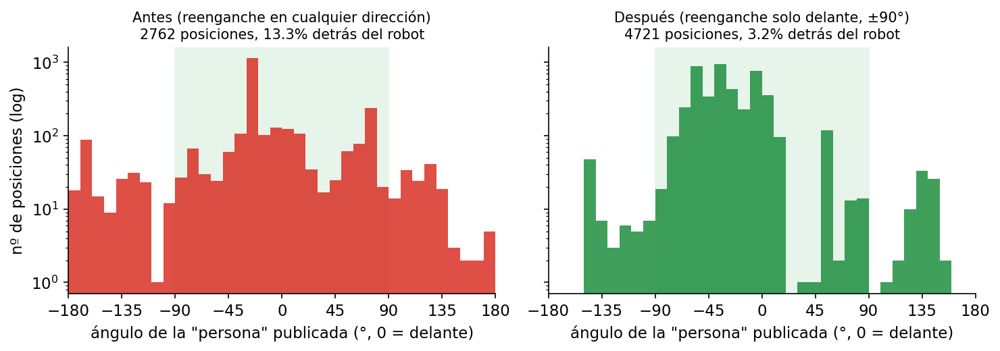
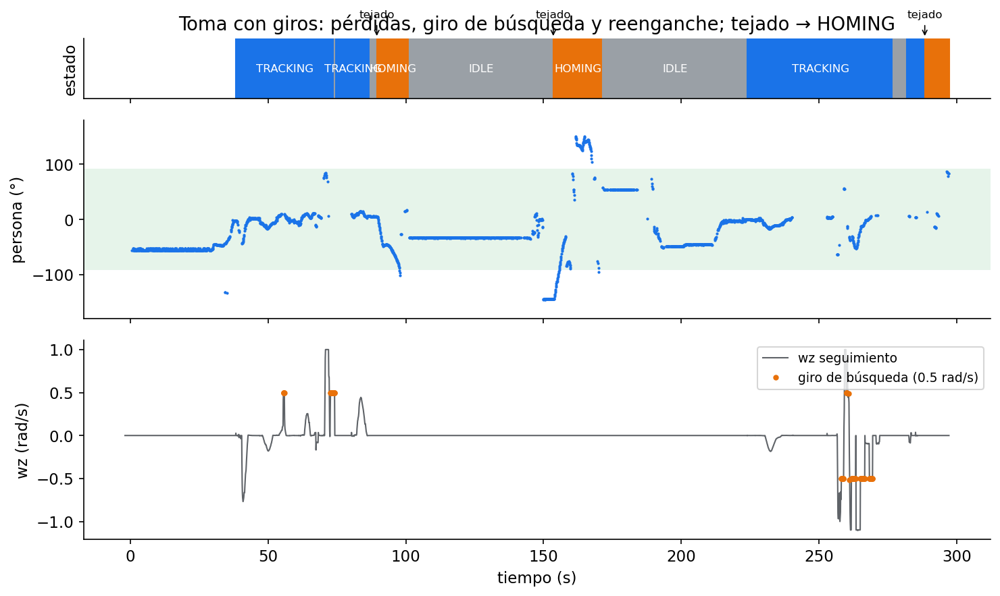

**Reproducir las figuras:** `validation/extract_casa_bags.py` (con ROS, sobre
`~/tfm_bags/20260923_*`) → `validation/plot_casa_session.py` (sin ROS).
Métricas por vuelta en `docs/figuras/gesto_casa/metricas_homing.csv`.

## 7.5 Limitaciones de los resultados actuales

*Revisada por completo el 2026-09-23. Las entradas de julio que los fixes de
las Sesiones 4-5 habían dejado obsoletas (gate de continuidad sin validar,
`near_gain` sin aislar, gesto no utilizado) se han retirado: están resueltas
y documentadas en §7.4-§7.4bis.*

**Metodología**

- **Tamaño de muestra pequeño.** La mayoría de escenarios tienen N=2-3 (N=1
  en `parada`/`oclusion`), y el gesto "casa" 12 activaciones en una sola
  sesión. Son suficientes para mostrar que el comportamiento funciona y es
  repetible, no para estimar tasas con precisión estadística.
- **Saturación angular reproducible pero alta en las tomas del 08/07**
  (§7.4). El pipeline reproducible no confirmó la mejora 94.5%→12.4% del
  script ad-hoc original. Hipótesis sin confirmar: pocas muestras "estables"
  en tomas cortas y acercamiento sin `near_gain`, que entonces no existía.
- **Un solo entorno.** Todo se ha medido en el mismo laboratorio, con la
  misma persona y la misma iluminación.
- **Sin ground truth externo.** Las posiciones del robot salen de
  odometría/AMCL y las de la persona del propio detector. No hay sistema de
  captura de movimiento que mida el error absoluto.

**Percepción y seguimiento**

- **Límite de altura del LIDAR 2D.** Un obstáculo que sobresale por encima
  del plano de escaneo (~47 cm), como el asiento de una silla de patas
  finas, no se detecta. Confirmado con 5 contactos reales (§7.4ter). Mitigación
  pendiente de sensor (cámara RGBD Orbbec, segundo LIDAR).
- **La evasión de obstáculos no distingue a la persona seguida.** Si la
  persona se acerca a menos de ~0.4 m, el robot la trata como obstáculo y
  frena o dispara el rodeo contra ella (Sesión 8). Por diseño, la persona
  seguida no debería estar tan cerca (`target_distance`=1.0 m).
- **Pérdidas de detección al girar.** Al girar, una pierna tapa a la otra y
  la persona sale del campo de la cámara: huecos de 1-8 s. Se han mitigado
  (fallback de pierna única, giro de búsqueda, reenganche frontal), no
  eliminado. Si la persona se queda detrás del robot, este no la retoma:
  tiene que volver a ponerse delante.
- **Gesto de espaldas más lento.** La cabeza tapa una muñeca y su
  visibilidad cae por debajo del umbral. El tejado de espaldas se reconoce,
  pero puede tardar varios segundos más (peor caso ~13 s, estando además
  demasiado cerca de la cámara).

**Navegación y gesto "casa"**

- **Vuelta a casa desde junto a un obstáculo.** Si la pose estimada del
  robot cae en la zona inflada de un obstáculo del mapa, Nav2 no planifica
  y la vuelta falla (2/11). No se ha implementado ninguna maniobra previa
  para "despegarse" del obstáculo.
- **Precisión de AMCL.** σ≈0.5 m durante toda la sesión del 23/09, con saltos
  de hasta 0.4 m en recuperaciones. Condiciona el error de llegada (0.27 m
  de media) y los fallos anteriores.
- **Casa es una única pose fija.** El objetivo 5 completo (guiado a varios
  destinos del edificio) queda como trabajo futuro. La arquitectura
  (`control_node` + `NavigateToPose`) lo admite añadiendo gestos o destinos.
- **Nav2 no se activa solo** si se lanza antes de dar la pose inicial. Hay
  que activarlo con `scripts/activate_nav2.sh`.
- **Condición de carrera rara en preemptions** (Sesión 7, 1 caso en 10+):
  se autorrecupera.

## 7.6 Pendiente para completar este capítulo

- [x] ~~Validar `near_gain` de forma aislada~~ — hecho 2026-07-15, ver
  `PROGRESO.md`. Reforzado con casos límite el 2026-07-22 (`corto` #3, 0.02m).
- [x] ~~Repetir tomas con `continuity_confirm_frames` ajustado~~ — hecho
  2026-07-21 (Sesión 4), ver 7.4bis y `docs/decisiones.md`.
- [x] ~~Re-ejecutar `bag_to_csv.py`/`plot_run.py` sobre los tres bags de la
  tabla 7.4~~ — hecho 2026-07-21, tabla 7.4 ya actualizada.
- [x] ~~Repeticiones (2-3 tomas por escenario)~~ — hecho 2026-07-22 para
  `recta`/`curva`/`corto` (ver 7.4bis). `parada`/`oclusion` siguen en N=1.
- [x] ~~Grabar al menos una toma con el gesto real funcionando~~ — hecho
  desde 2026-07-09, todas las tomas de 7.4bis usan el gesto real.
- [ ] Repetir `parada` y `oclusion` una vez más cada una (N=1 todavía) si
  sobra tiempo en una sesión futura — no bloquea el capítulo.
- [x] ~~Repetir `obstaculo` con `obstacle_threshold=0.40m`~~ — hecho
  2026-07-22 (ver 7.4ter): llevó a corregir `lin_factor` (parada dura real)
  y a una maniobra de rodeo nueva, ambas sin contacto en la última toma.
- [x] ~~Repetir `obstaculo` con la silla de patas finas del 21/07~~ —
  hecho 2026-07-22 (`obstaculo_v8`): **confirmado con un 5º contacto real**
  que la silla no se detecta en absoluto (límite de altura del LIDAR,
  47cm) — cerrado como limitación de arquitectura, no se reintenta en vivo
  sin mitigación de sensor (Orbbec RGBD, segundo LIDAR).
- [x] ~~Repetir `obstaculo_v7`/`v8` con mobiliario sólido (sin la silla
  fina) una vez más para no quedarse en N=1 con la maniobra de rodeo~~ —
  hecho 2026-07-23 (`obstaculo_v9_mueble`): sin contacto, N=2 confirmado.
- [x] ~~Actualizar §7.5 (limitaciones)~~ — revisada por completo el
  2026-09-23.
- [x] ~~Incorporar el gesto "casa" (objetivo 5, primer paso)~~ — hecho
  2026-09-23, ver §7.4quinquies.
- [x] ~~Incorporar resultados de Nav2~~ — hecho 2026-07-27 (Sesión 7), ver
  §7.4quater: objetivo 3 completado (fase A + fase B + remapeo).
- [ ] Sustituir este borrador por prosa de memoria una vez el conjunto de
  datos esté completo — este archivo está pensado como andamiaje de
  trabajo, no como texto final de la memoria.
